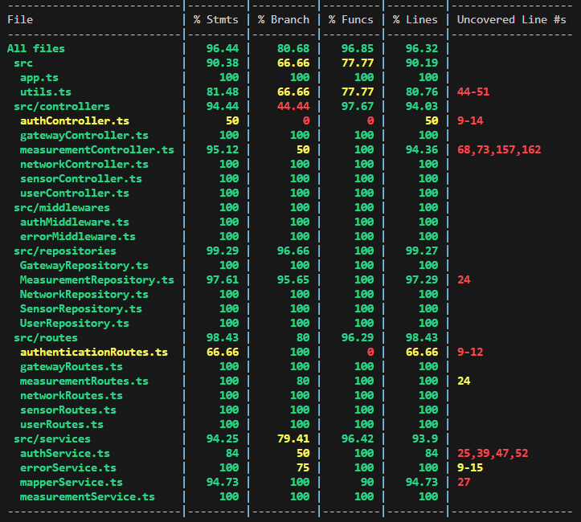

# Test Report

The goal of this document is to explain how the application was tested, detailing how the test cases were defined and what they cover

# Contents

- [Test Report](#test-report)
- [Contents](#contents)
- [Dependency graph](#dependency-graph)
- [Integration approach](#integration-approach)
- [Tests](#tests)
- [Coverage](#coverage)
  - [Coverage white box](#coverage-white-box)

# Dependency graph

![Dependency Graph - GeoControl System (Simplified)](http://www.plantuml.com/plantuml/png/fLRRZjCm47ttLmpXWOkq2xoYLKLfouBKtQpI1OI4XBp9jBNgs9OzfKHeN_a2lf0lGKxJn4rIbgflIUQSC-DZvoHl775Bwrp260sg35LQmANbPWbdS8bwf1LPBM5MEC8Sdiv4RgIO2yoUCVQ8bfWZ6Cc5OcubbE6Mvt37qzN2whNAHbfg2vkb80pggSwDLgXeHeL4i9WILmk9Z3tAS2uKmkV9s-7DpRTHF8qJa6Anf8L5L7Lz55_V9l5qEab2J5hm1ZAR99y-Z2PXlK0fzQP699ERUFRXDaw-X20ZrAg6NCNZoNH_35umzWIkk50mD4QAb9FG2gQyGClgbK74ZJad5m5tm8s1Yul93sFHESyQ3E1nk4IlM1ajqRfApF1qnHS8KTgK8lZ90022Hck7jY57S77HtFb6RQ_QV8MqqNPrYiI24svuSOg4G-NqIUl8aRkrnHmL7ILpxzsVeVqkKknOxwhdFRxdt1Yq5T7tgIvzaxt3zuz1_uTTpfUWqKwGjaLxGhkhYDufFpgq3TatQkvyh_PBqEPVRq_7AHANszDnYiIiF1sdA5mrfXybKxe_viJlk4EOA18aqC7JyJ1-rcn2hZEKxaN6zO4j60zZtwpabus2P3bW-J6Kok9ZA5jBZs445lwJTjyRaEzyzFeaF3iRm7vcrOyxKLHNEWbJLzh1KHTwyw2TjAJhLv_j3mLdrWT-gHI-wQmpv45aP-Y3oFOY3W9x5nMYEzdoC6MlGTUV90YOZaUPtYWliXypVHxja9r0wREf10-Wanm7iRt2NLShtNQS74BsZd30pqgwDsSUu7Gd3xz8sUw_pFlVtL_etSDmqo3dogVKU1WxjhzHiDkxyJ1cdJ4WiDK3Ebv0u907j7qjwtNGi5vlIin-jFW5RAC54fHbVBYbC8uriq3qAjgTuG54By_FdqVX9CrbBxAPgRxgnRNcUa2rkufhJUXWhYsaabj11LEQ42JE2VIy_35y3T7kpv07SRaHj0IhruGksf986y_fEG6l8NhFLIRHWIDEmf587N2LVLLwJLAWXGm9KozSYTrf8fsNUk7HyL8ZhRwZ9UVF2_pvzHl6jt74s1jKsJgNVm40 "Dependency Graph - GeoControl System (Simplified)")

# Integration approach

  The integration approach adopted was a mixed (incremental) strategy, using a bottom-up approch.

  **Integration sequence:**
  1. **Step 1:** Unit testing of individual repository modules (e.g., GatewayRepository, MeasurementRepository, etc.).
  2. **Step 2:** Unit testing of service layer modules, integrating with mocked repositories for business logic and data transformation.
  3. **Step 3:** Integration testing of controller modules, combining controllers with service implementations and mocked repositories.
  4. **Step 4:** Integration testing of route modules, wiring up HTTP routes with controllers and middleware, using in-memory servers for request/response validation.
  5. **Step 5:** End-to-end (E2E) API testing (routes, middleware, controllers, services, repositories, and database).

# Tests

## Unit Tests - Repository Layer

| Test case name | Object(s) tested | Test level | Technique used |
| :------------: | :--------------: | :--------: | :------------: |
| GatewayRepository.db.test | createGateway, getGatewayByMacAddress | Unit | (T1.1, T2.2, T3.1, T4.1-T4.2, T5.1-T5.2; equivalence partitioning), (T1.2, T2.1, T3.2, T4.3-T4.4; boundary) |
| GatewayRepository.mock.test | createGateway, getGatewayByMacAddress, deleteGateway, getAllGateways | Unit | (T1.1, T2.1, T3.1, T4.1-T4.2, T5.1-T5.2; equivalence partitioning), (T1.2, T2.2, T3.2, T4.3-T4.4; boundary) |
| MeasurementRepository.db.test | createMeasurement, getMeasurements, deleteMeasurements | Unit | (T1.1-T1.4, T2.1-T2.3, T2.8, T3.1-T3.4, T3.10-T3.11, T3.14; equivalence partitioning), (T2.4-T2.7, T3.5-T3.9, T3.12-T3.13; boundary) |
| MeasurementRepository.mock.test | createMeasurement, getMeasurements, deleteMeasurements | Unit | (TM1.1-TM1.4, TM2.1-TM2.3, TM2.8, TM3.1-TM3.4, TM3.8, TM3.11; equivalence partitioning), (TM2.4-TM2.7, TM3.5-TM3.7, TM3.9-TM3.10; boundary) |
| NetworkRepository.db.test | createNetwork, getNetworkByName, deleteNetwork, getAllNetworks | Unit | (T1.1,T2.1,T3.1,T4.1,T5.1; equivalence partitioning), (T2.2,T3.2,T4.2,T4.3,T5.2; boundary)|
| NetworkRepository.mock.test | createNetwork, getNetworkByName, deleteNetwork, getAllNetworks | Unit | (T1.1,T2.1,T3.1,T4.1,T5.1; equivalence partitioning), (T2.2,T3.2,T4.2,T5.2; boundary) |
| SensorRepository.db.test | createSensor, getSensorByMacAddress, deleteSensor, getAllSensors | Unit | (T1.1,T2.2,T3.2,T4.1,T5.1; equivalence partitioning), (T1.2,T2.2,T3.2,T3.3,T3.4,T4.2,T5.2; boundary) |
| SensorRepository.mock.test | createSensor, getSensorByMacAddress, deleteSensor, getAllSensors | Unit | (T1.1,T2.1,T3.1,T4.1,T5.1; equivalence partitioning), ( T1.2,T2.2,T3.2,T3.3,T4.2,T5.2; boundary)|
| UserRepository.db.test | createUser, getUserByUsername, deleteUser, getAllUsers | Unit | (T1.1,T2.1,T3.1,T4.1; equivalence partitioning), (T1.2,T2.2,T3.2,T4.2; boundary) |
| UserRepository.mock.test | createUser, getUserByUsername, deleteUser, getAllUsers | Unit | (T1.1,T2.1,T3.1,T4.1; equivalence partitioning), (T1.2,T2.2,T3.2,T4.2; boundary)  |

## Unit Tests - Service Layer

| Test case name | Object(s) tested | Test level | Technique used |
| :------------: | :--------------: | :--------: | :------------: |
| measurementService.test | mapMeasurementDAOToDTO, mapMeasurementsDAOToDTO, createMeasurementsDTO, calculateStatsDTO, flagMeasurementsDTOoutliers | Unit | (T1.1, T2.1, T3.1, T4.1, T5.1; equivalence partitioning), (T1.2, T2.2, T3.2, T4.2-T4.3, T5.2; boundary) |

## Integration Tests - Controller Layer

| Test case name | Object(s) tested | Test level | Technique used |
| :------------: | :--------------: | :--------: | :------------: |
| gatewayController.integration.test | gatewayController functions, mapperService | Integration | (T1.1-T5.2; equivalence partitioning/boundary) |
| measurementController.integration.test | measurementController functions, mapperService | Integration | (T1.1-T7.1; equivalence partitioning/boundary) |
| networkController.integration.test | networkController functions, mapperService | Integration | (T1.1-T5.2; equivalence partitioning/boundary) |
| sensorController.integration.test | sensorController functions, mapperService | Integration | (T1.1-T5.2; equivalence partitioning/boundary) |
| userController.integration.test | userController functions, mapperService | Integration | (T1.1-T4.2; equivalence partitioning/boundary) |

## Integration Tests - Route Layer

| Test case name | Object(s) tested | Test level | Technique used |
| :------------: | :--------------: | :--------: | :------------: |
| gatewayRoutes.integration.test T1.x-T5.x | HTTP routes, authMiddleware, gatewayController | Integration | (T1.1-T5.5; equivalence partitioning/ T2.2, T4.2 boundary) |
| measurementRoutes.integration.test T1.x-T7.x | HTTP routes, authMiddleware, measurementController | Integration | (T1.1-T7.6; equivalence partitioning/ T1.3, T2.3, T3.3, T4.2, T5.3, T6.3, T7.3 boundary) |
| networkRoutes.integration.test T1.x-T5.x | HTTP routes, authMiddleware, networkController | Integration | (T1.1-T5.5; equivalence partitioning/ T2.2, T4.2 boundary) |
| sensorRoutes.integration.test T1.x-T5.x | HTTP routes, authMiddleware, sensorController | Integration | (T1.1-T5.5; equivalence partitioning/ T2.2, T4.2 boundary) |
| userRoutes.integration.test T1.x-T4.x | HTTP routes, authMiddleware, userController | Integration | (T1.1-T4.5; equivalence partitioning/ T2.2 boundary) |

## E2E Tests - API Level

| Test case name | Object(s) tested | Test level | Technique used |
| :------------: | :--------------: | :--------: | :------------: |
| gateways.e2e.test | Gateway API endpoints, authentication, authorization | API | (T1.1-T5.4; equivalence partitioning/boundary) |
| measurements.e2e.test | Measurement API endpoints, authentication, authorization | API | (T1.1-T7.4; equivalence partitioning/boundary) |
| networks.e2e.test | Network API endpoints, authentication, authorization | API | (T1.1-T5.4; equivalence partitioning/boundary) |
| sensors.e2e.test | Sensor API endpoints, authentication, authorization | API | (T1.1-T5.4; equivalence partitioning/boundary) |
| users.e2e.test | User API endpoints, authentication, authorization | API | (T1.1-T4.4; equivalence partitioning/boundary) |

# Coverage

## Coverage white box

